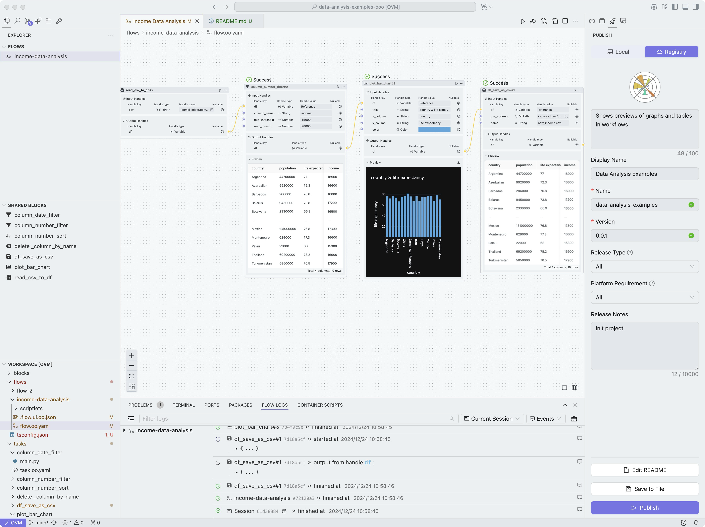

# Introduction

This project is a data analysis workflow that consists of four task nodes.

## Task Node 1: Read CSV File

* Task ID: `read_csv_to_df#2`
* Input Parameters:
	+ `csv`: CSV file path, value is `/oomol-driver/oomol-storage/data.csv`
* Output Parameters:
	+ `df`: Read DataFrame object

## Task Node 2: Data Filtering

* Task ID: `column_number_filter#2`
* Input Parameters:
	+ `df`: Input DataFrame object, output from `read_csv_to_df#2` task node
	+ `column_name`: Column name, value is `income`
	+ `min_threshold`: Minimum threshold, value is `15000`
	+ `max_threshold`: Maximum threshold, value is `20000`
* Output Parameters:
	+ `df`: Filtered DataFrame object

## Task Node 3: Data Visualization

* Task ID: `plot_bar_chart#3`
* Input Parameters:
	+ `df`: Input DataFrame object, output from `column_number_filter#2` task node
	+ `y_column`: Y-axis column name, value is `life expectancy`
	+ `color`: Bar chart color, value is `#62B0E3`
	+ `title`: Chart title, value is `country & life expectancy`
	+ `x_column`: X-axis column name, value is `country`
* Output Parameters:
	+ `df`: Visualized DataFrame object

## Task Node 4: Save CSV File

* Task ID: `df_save_as_csv#1`
* Input Parameters:
	+ `csv_address`: CSV file save path, value is `/oomol-driver/oomol-storage`
	+ `df`: Input DataFrame object, output from `plot_bar_chart#3` task node
	+ `name`: CSV file name, value is `new_income.csv`